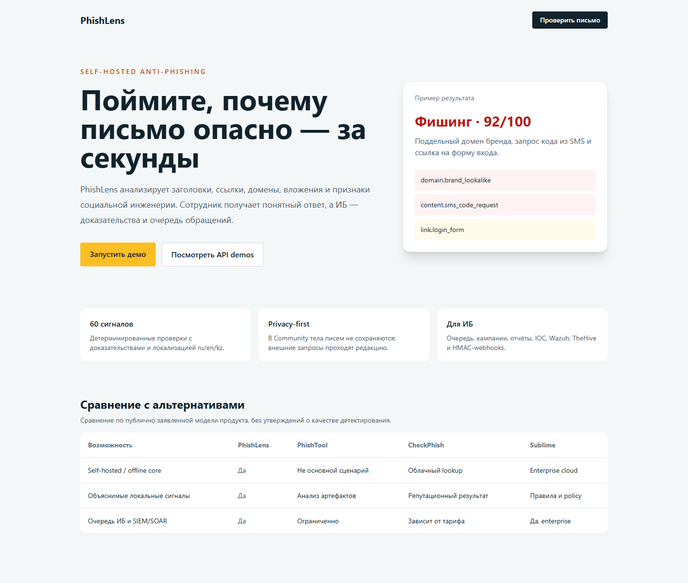

# PhishLens

> Accuracy boundary: the repository includes a deterministic synthetic
> regression corpus, not a production-representative dataset. See
> [corpus provenance](docs/corpus-provenance.md) before interpreting F1 results.

> «Отправь письмо — получи вердикт и объяснение за 5 секунд».

Self-hosted сервис анализа подозрительных писем: детерминированные проверки
(заголовки, SPF/DKIM/DMARC, домены, ссылки, вложения), репутация, сходство с брендами
(включая казахстанские — Kaspi, Halyk, eGov, Beeline…) и LLM-объяснение на языке сотрудника.

**Статус: Community v1 ядро** — рабочий CLI/API/UI-конвейер для текста и EML,
детерминированные сигналы, SQLite, API-ключи, списки, метрики и отчётность по
локальному корпусу. Business-интеграции и внешние провайдеры остаются отдельными
проверяемыми гейтами; текущий статус зафиксирован в [TODO.md](TODO.md).

## Быстрый старт

Требуется Go 1.26.7+ (зафиксированный patch-level нужен для security fixes
стандартной библиотеки; ТЗ допускает 1.23+, но текущие зависимости требуют
более новую версию).

```bash
go build -o bin/phishlens ./cmd/phishlens
./bin/phishlens analyze --file data/demo/phish_kaspi_01.eml
./bin/phishlens analyze --text "Срочно подтвердите перевод: http://kaspi-secure-login.com" --no-llm
./bin/phishlens serve --config configs/config.example.yaml   # http://localhost:8082
```

С Taskfile (`go install github.com/go-task/task/v3/cmd/task@latest`):

```bash
task build && task test && task run
```

Для публикации контейнера в GHCR создайте semver-тег и отправьте его
(текущий проверенный Community-релиз — `v0.2.3`):

```bash
git tag v0.2.3
git push origin v0.2.3
```

Workflow `release.yml` соберёт образ с runtime-данными и опубликует версию тега
и `latest` в [ghcr.io/adikezh/phishlens](https://github.com/adikezh/phishlens/pkgs/container/phishlens).

## Структура

```
cmd/phishlens         точка входа (cobra)
internal/domain       модель данных (Submission, ParsedMail, Signal, Analysis)
internal/parse        eml / msg / text / image / pdf → ParsedMail
internal/signals      одна папка на категорию, один файл на сигнал; registry
internal/brands       brands.yaml, matcher (домен / ключевые слова / homoglyph)
internal/reputation   DNSBL, RDAP, OpenPhish, optional authenticated URLhaus
internal/llm          провайдеры (openai_compatible, anthropic, ollama), редакция PII, схема
internal/score        веса, пороги, жёсткие правила, вердикт
internal/store        SQLite (modernc) / PostgreSQL (pgx), миграции
internal/httpapi      REST /v1/* (chi), /health, /metrics
internal/web          UI анализа + очередь/кампании/дашборд/бренды (html/template + htmx)
internal/notify       webhook (HMAC), Wazuh, TheHive, IRIS, Jira, SMTP reply
internal/ingest       IMAP / Graph / Telegram приёмники с bounded polling
deploy/ocr            локальный Tesseract OCR HTTP-контейнер (ru/en/kz)
data/                 brands.yaml, weights.yaml, словари, демо-письма
docs/signals/         документация каждого сигнала
```

`phishlens weights tune` calibrates signal weights from analyst JSONL labels:

```json
{"label":"phishing","signals":{"domain.brand_lookalike":1,"content.credential_request":0.8}}
{"label":"clean","signals":{"content.urgency":0.5}}
```

```powershell
phishlens weights tune --labels labels.jsonl --out weights.tuned.yaml
```

The tuner preserves thresholds, keeps unseen base signals, and bounds learned
weights to -100..100. Review the output before using it as a pilot override.

Продуктовая landing-страница доступна локально на `/landing`; интерактивное
демо проверки — на `/`.



Схема конвейера и границы компонентов описаны в [architecture.md](docs/architecture.md),
а сравнение с PhishTool, CheckPhish и Sublime — на `/landing`.
Performance acceptance is documented in [performance.md](docs/performance.md).

## Что работает локально

- `analyze --text/--file` — парсинг `.eml`/текста, зарегистрированные проверки,
  ru/en/kz объяснения, скоринг, вердикт, JSON-вывод; при отсутствии
  `Authentication-Results` для EML включается собственная SPF/DKIM/DMARC
  DNS-проверка.
- `serve` — `POST /v1/analyze`, `GET /v1/analyses/{id}`, очередь и review actions,
  списки, бренды, `/health`, `/metrics`, UI на `/` и `/ui/{queue,campaigns,dashboard,brands}`.
- `batch` / `eval` — прогон корпуса и precision/recall/F1 по золотым вердиктам (`--min-f1` для CI; три демо — macro-F1 = 1.0, это не production benchmark).
- `report --format awareness` — HTML-карточки для обучения сотрудников из
  подтверждённых кейсов без адресов, тем и текста писем.
- `migrate up`, `apikey create`, `lists allow|block add|list`.
- `backup --out backup.db` / `restore --in backup.db --force` — validated,
  atomic SQLite backup/restore; stop the service before restore.

## Что не входит в подтверждённый Community v1

PDF/vision без отдельного backend, live-провайдеры и sandbox (chromedp), IMAP/Graph/Telegram,
OIDC и hosted add-in validation. Они явно возвращают ошибку или
degraded warning и не маскируются под успешный анализ. Локальный OCR-контейнер
описан в [ocr.md](docs/ocr.md). См. [TODO.md](TODO.md).

## Лицензия

Core — AGPL-3.0. Коммерческая лицензия для встраивания и enterprise — по запросу.
